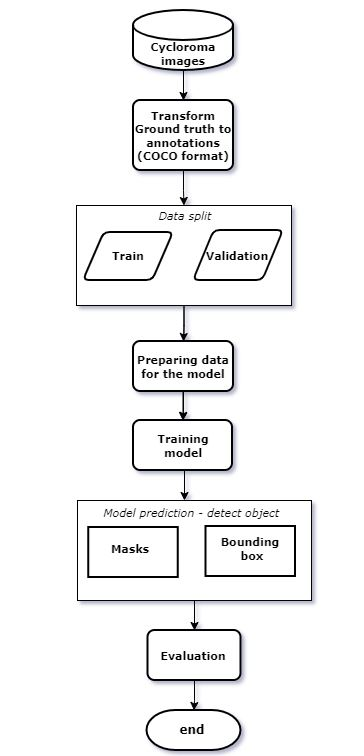
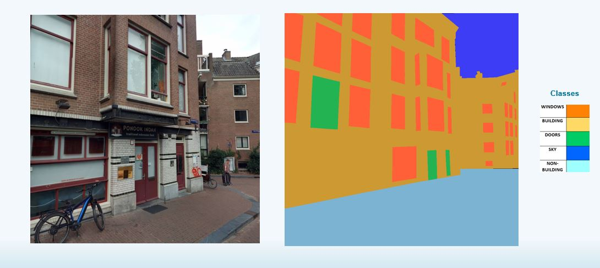

# **AUTOMATED OBJECT DETECTION OF WINDOWS AND DOORS ON BUILDINGS FROM STREET-VIEW IMAGERIES**

**Author- Shanmathi Barathidhasan**

This repository includes a methodology for automatically detecting openings like doors and windows on the building from street view imageries completed as an **_internship work at Geo Expertise Centre of the Kadaster, the Netherlands_**. For this specific task, an introduction to computer vision techniques, specifically the object detection that can be performed by artificial intelligence, will be useful. Here, **_the transfer learning on detectron2's Mask- RCNN object detection model_** was performed to achieve the goal of detecting the openings on the buildings.

A small urban centre within _Amsterdam city of the Netherlands_ was chosen as a case study for this work.

# Overview 

- Description of Folders
- Getting Started 
- Requirements

- Acquisition of data
    -  Steps to Acquire data
- Object Detection Model 
    - Prepare data
    - Train data 
    - Evaluate model

# Files and Folders
### 1. Within the Dataset Folder


### 2. Within the detectron 1-2 folder
Only the key folders and files for this project are shown below:


# Getting Started 

_Reference : https://ai.facebook.com/blog/-detectron2-a-pytorch-based-modular-object-detection-library-/_

Check basic Detectron2 documentation before getting started: _https://detectron2.readthedocs.io/en/latest/_

Detectron2 is released under **the Apache 2.0 license.** _https://github.com/facebookresearch/detectron2/blob/main/LICENSE_

# Requirements

Installations for Detectron2 refer: _https://detectron2.readthedocs.io/en/latest/tutorials/install.html_

### **Other Packages:**
-  xml.etree.ElementTree module
- requests module
- urllib.request module
- setuptools==59.5.0

#  Acquisition of data 

In recent times, the street view imageries has become one of the important geospatial datasets collections in the field of the urban analytic and are helpful in making informed decisions _(Biljecki & Ito, 2021)._ Here, the dataset chosen is **_panoramic street view imagery provided by Cyclomedia, namely Cycloroma._** The dataset provided by the Cyclomedia is said to be rendered with Panoramic Rendering service which creates cut-outs of panoramic images in central perspectives.

Flowchart on acquiring streetview imageries:


## Steps to Acquire Data
- Get the API key and request for xml files of image meta data
Documentation of Cyclomedia: https://docs.cyclomedia.com/Atlas/2020/Atlas%20Panorama%20Rendering%20Service.pdf

- RUN the code file acquiring_data.py

# Object Detection Model

Flowchart on the steps to detect the openings on buildings:




- Build the docker image using the below code: 
``` 
cd docker
docker build -t detectron2:v0 .
```
- Run the below code for running the docker container:
```
docker run --gpus all -it --rm --shm-size=16gb --env="DISPLAY" --volume="C:/Users/yourdirectory":/scripts  detectron2:v0 /bin/bash
```
- pip install setuptools==59.5.0
- Use the environment variable CUDA_VISIBLE_DEVICES to control which GPUs to use.
- RUN the code file custom_model.py to execute preparing, training and evaluation of data.
## Prepare Data
- Tranform the ground truth to annotations in  COCO format. For this project CVAT used for creating annotations.
- Below shown the representation of the annotations created and used:


- Splitting the dataset to train and val 
- Registering the dataset to detectron2's standard format


## Train Data
- Training a COCO-pretrained R50-FPN Mask R-CNN model on our dataset
- Prediction on the val dataset is carried out for validation pupose and the output images with instance segmentation are saved in the output_images folder as .jpg file

  


## Evaluate Model
- COCOEvaluator to evaluate  Average Precision(AP) for box detection, instance segmentation, keypoint detection on dataset.

- The AP for each predicted classes for each image is stored in the output_images folder as .txt file

## Reference 

@misc{wu2019detectron2,
  author =       {Yuxin Wu and Alexander Kirillov and Francisco Massa and
                  Wan-Yen Lo and Ross Girshick},
  title =        {Detectron2},
  howpublished = {\url{https://github.com/facebookresearch/detectron2}},
  year =         {2019}
}

Biljecki, F., & Ito, K. (2021). Landscape and Urban Planning Street view imagery in urban analytics and GIS : A review. Landscape and Urban Planning, 215(November 2020), 104217. https://doi.org/10.1016/j.landurbplan.2021.104217

Doll, P., Girshick, R., He, K., & Gkioxari, G. (n.d.). Mask R-CNN.

He, H., Xu, H., Zhang, Y., Gao, K., Li, H., Ma, L., & Li, J. (2022). Mask R-CNN based automated identification and extraction of oil well sites. International Journal of Applied Earth Observation and Geoinformation, 112(January), 102875. https://doi.org/10.1016/j.jag.2022.102875